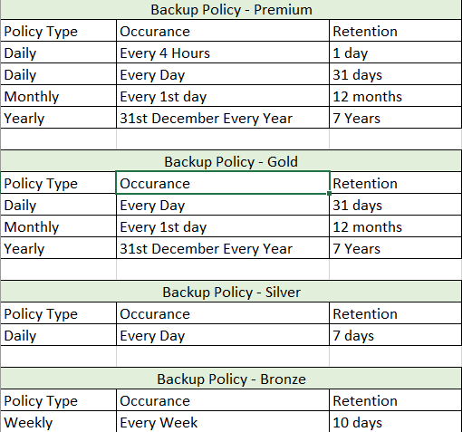

<p align="center">
  <a href="" rel="noopener">
 </a>
</p>

<h3 align="center">AWS Backup</h3>

<div align="center">

[]()
[](/LICENSE)

</div>

---

<p align="center"> Backup Solution for resources in AWS Cloud.
    <br> 
</p>

## 📝 Table of Contents

- [About](#about)
- [Getting Started](#getting_started)
- [Usage](#usage)
- [Built Using](#built_using)
- [Authors](#authors)

## 🧐 About <a name = "about"></a>

AWS Backup enables you to centralize and automate data protection across AWS services.
Most of the organization on AWS wants to leverage the AWS Backup solution but not sure what to backup ? or what should be the schedule ?

This template enables the orgnization/ System Admin to choose Backup solution they require.

## Backup Schedule


## 🏁 Getting Started <a name = "getting_started"></a>

These instructions will help the deloy the template on your AWS Environment for development and testing purposes. See [Usage](#Usage) for notes on how to deploy the project on a live system.

### Prerequisites

What things you need to install the software and how to install them.
  1. AWS CLI
  2. AWS Credentials


## 🎈 Usage <a name="usage"></a>

1. clone [This](https://github.com/ankitosh/aws-backup.git) repo.
    ```
    git clone https://github.com/ankitosh/aws-backup.git
    ```
2. Run aws cli command to run the cloudformation based on your backup Type
    ```
    aws cloudformation create-stack --stack-name "goldbackup" --template-body file://BACKUP-Gold.yaml --parameter-overrides KMSKey="KMS-ARN" --capabilties CAPABILITIES_NAMED_IAM 
    ```

## ⛏️ Built Using <a name = "built_using"></a>

- [CloudFormation](https://aws.amazon.com/cloudformation/) - Template

## ✍️ Authors <a name = "authors"></a>

- [@ankitosh](https://github.com/ankitosh) - Idea & Initial work
